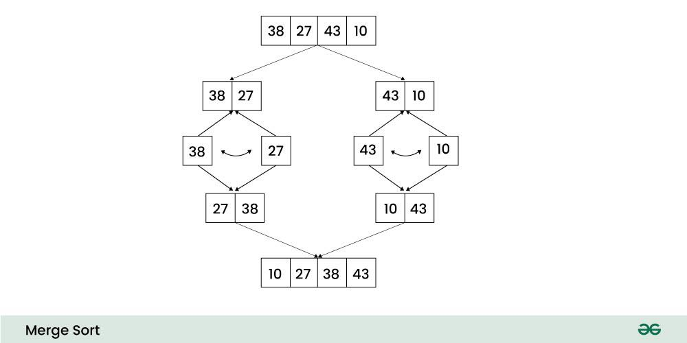

## 개요

**분할 정복(divide and conquer)** 알고리즘을 기반으로 하는 정렬 방식으로, 하나의 리스트를 두 개의 균등한 크기로 분할하고 분할된 부분 리스트를 정렬한 다음, 두 개의 정렬된 부분 리스트를 합하여
전체가 정렬된 리스트가 되게 하는 방법이다.

## 프로세스 (오름차순)

- 리스트의 길이가 1 이하이면 이미 정렬된 것으로 본다.
- 분할(Divide): 정렬되지 않은 리스트를 절반으로 잘라 비슷한 크기의 두 부분 리스트로 나눈다.
- 정복(Conquer): 각 부분 리스트를 재귀적으로 합병 정렬을 이용해 정렬한다.
- 결합(Combine): 두 부분 리스트를 다시 하나의 정렬된 리스트로 합병한다.



## Array Code (오름차순)

```java
public void mergeSort(int[] arr, int left, int right) {
    if (left < right) {
        int mid = (left + right) / 2;

        mergeSort(arr, left, mid);        // 분할(Divide)
        mergeSort(arr, mid + 1, right);   // 분할(Divide)
        merge(arr, left, mid, right);     // 결합(Combine)
    }
}

public void merge(int[] arr, int left, int mid, int right) {
    int[] temp = new int[right - left + 1];
    int i = left, j = mid + 1, k = 0;

    // 분할된 두 리스트를 병합하는 과정
    while (i <= mid && j <= right) {
        if (arr[i] <= arr[j])
            temp[k++] = arr[i++];
        else
            temp[k++] = arr[j++];
    }

    // 남은 데이터 처리
    while (i <= mid)
        temp[k++] = arr[i++];
    while (j <= right)
        temp[k++] = arr[j++];

    // 임시 배열의 데이터를 원본 배열에 복사
    for (i = left; i <= right; i++)
        arr[i] = temp[i - left];
}
```

## Linked List Code (오름차순)

```java
class Node {
    int data;
    Node next;

    Node(int data) {
        this.data = data;
        this.next = null;
    }
}

public class LinkedListMergeSort {
    public Node mergeSort(Node head) {
        if (head == null || head.next == null) {
            return head;
        }

        // 중간 지점 찾기
        Node middle = getMiddle(head);
        Node nextOfMiddle = middle.next;
        middle.next = null;

        // 분할
        Node left = mergeSort(head);
        Node right = mergeSort(nextOfMiddle);

        // 병합
        return merge(left, right);
    }

    private Node merge(Node left, Node right) {
        if (left == null) return right;
        if (right == null) return left;

        Node result;
        if (left.data <= right.data) {
            result = left;
            result.next = merge(left.next, right);
        } else {
            result = right;
            result.next = merge(left, right.next);
        }
        return result;
    }

    private Node getMiddle(Node head) {
        if (head == null) return head;

        Node slow = head;
        Node fast = head;

        while (fast.next != null && fast.next.next != null) {
            slow = slow.next;
            fast = fast.next.next;
        }
        return slow;
    }
}
```

## 시간복잡도

**최선의 경우(Best cases):** `O(nlog₂n)`

- 분할 단계: `log₂n`
- 각 분할 단계에서의 비교 연산: `n`
- 전체 시간 복잡도: `nlog₂n`

**최악의 경우(Worst cases):** `O(nlog₂n)`

- 분할 단계: `log₂n`
- 각 분할 단계에서의 비교 연산: `n`
- 전체 시간 복잡도: `nlog₂n`

**평균의 경우(Average cases):** `O(nlog₂n)`

## 공간복잡도

**배열 구현**

- 원본 배열: `O(n)`
- 임시 배열: `O(n)`
- 총 공간복잡도: `O(n)`

**링크드 리스트 구현**

- 원본 링크드 리스트: `O(n)`
- 추가 노드 생성 없이 포인터만 변경
- 총 공간복잡도: `O(log n)`

## 장점

**공통**

- 안정 정렬(Stable Sort)이다.
- 데이터의 분포에 영향을 덜 받는다. 입력 데이터가 무엇이든 정렬되는 시간은 동일하다.

**배열 구현**

- 캐시 지역성(Cache Locality)이 좋아 실제 실행 속도가 빠르다.
- 연속된 메모리 공간을 사용하여 메모리 접근이 효율적이다.

**링크드 리스트 구현**

- 포인터만 변경하므로 실제 데이터의 이동이 없다.
- 추가 메모리 공간이 거의 필요하지 않다.
- 데이터의 삽입과 삭제가 용이하다.

## 단점

**배열 구현**

- 추가적인 메모리 공간이 필요하다.
- 제자리 정렬(in-place sorting)이 아니다.
- 레코드의 크기가 큰 경우에는 이동 횟수가 많아 시간적 낭비가 크다.

**링크드 리스트 구현**

- 랜덤 접근이 불가능하여 중간 지점을 찾는데 `O(n)` 시간이 필요하다.
- 포인터를 위한 추가 메모리 공간이 필요하다.
- 캐시 지역성이 좋지 않아 실제 실행 속도가 배열에 비해 느릴 수 있다.