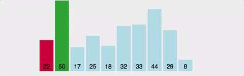

## 개요

__해당 순서에 원소를 넣을 자리를 선택하고, 그 자리에 어떤 원소를 넣을지 선택하는 알고리즘__

## 프로세스 (오름차순)

1. 주어진 배열에서 최솟값을 찾는다.
2. 찾은 최솟값을 첫번째 원소와 교체한다.
3. 첫번째 원소를 뺀 나머지 배열을 같은 방법으로 교체한다.



## Java Code (오름차순)

```java
void selectionSort(int[] arr) {
    int size = arr.length;
    int tmp, minIndex;
    for (int i = 0; i < size; i++) {
        minIndex = i;
        for (int j = i + 1; j < size; j++) {
            if (arr[j] < arr[minIndex])
                minIndex = j;
        }

        tmp = arr[i];
        arr[i] = arr[minIndex];
        arr[minIndex] = tmp;
    }
}
```

## 시간복잡도

`(n-1) + (n-2) + (n-3) + ... + 2 + 1 = n(n-1)/2`이므로 `O(n^2)`이다.

## 공간복잡도

주어진 배열 안에서 교환(swap)을 통해 정렬되므로 `O(n)`이다.

## 장점

- Bubble sort와 마찬가지로 단순하다.
- 정렬을 위한 비교 횟수는 많지만, Bubble sort에 비해 실제로 교환하는 횟수는 적기 때문에 비교적 효율적이다.
- 정렬하고자 하는 배열 안에서 교환하는 방식이므로 다른 메모리 공간을 필요로 하지 않는다. → 제자리 정렬(in-place sorting)

## 단점

- 시간복잡도가 `O(n^2)`으로 비효율적이다.
- 불안정 정렬(Unstable Sort)이다.
