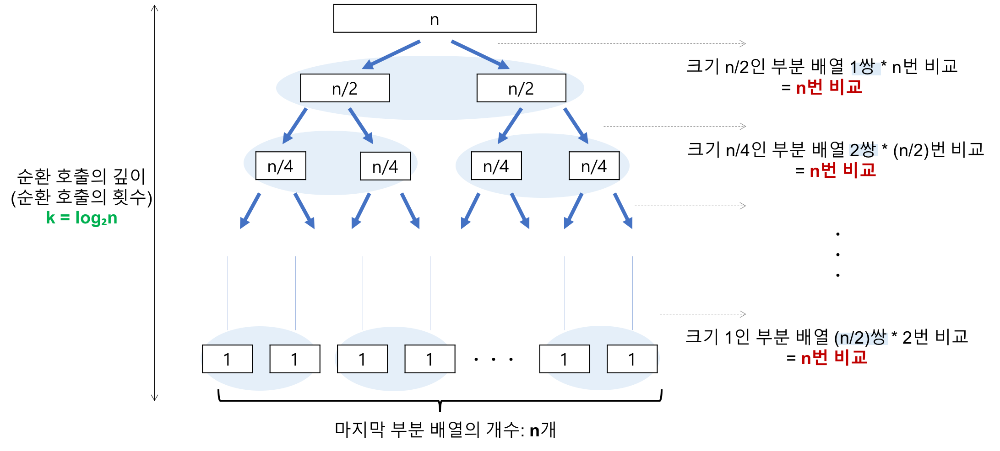

## 개요

__분할 정복(divide and conquer) 방법을 통해 주어진 배열을 정렬한다.__ <br>
__분할 정복 방법__: 문제를 작은 2개의 문제로 분리하고 각각을 해결한 다음 결과를 모아서 원래의 문제를 해결하는 전략

## 프로세스 (오름차순)

1. 하나의 원소(__피벗__)를 고른다.
2. 피벗을 기준으로 양쪽에서 피벗보다 큰 값, 혹은 작은 값을 찾는다. 왼쪽에서부터는 피벗보다 큰 값을 찾고, 오른쪽에서부터는 피벗보다 작은 값을 찾는다.
3. 양 방향에서 찾은 두 원소를 교환한다.
4. 왼쪽에서 탐색하는 위치와 오른쪽에서 탐색하는 위치가 엇갈리지 않을 때 까지 2번으로 돌아가 위 과정을 반복한다.
5. 엇갈린 기점을 기준으로 두 개의 부분리스트로 나누어 1번으로 돌아가 해당 부분리스트의 길이가 1이 아닐 때 까지 1번 과정을 반복한다. __(Divide: 분할)__
6. 인접한 부분리스트끼리 합친다. __(Conqure: 정복)__


## Java Code (오름차순)

```java
public void quickSort(int[] array, int left, int right) {
    if (left >= right) return;

    // 분할 
    int pivot = partition(array, left, right);

    // 피벗은 제외한 2개의 부분 배열을 대상으로 순환 호출
    quickSort(array, left, pivot - 1);  // 정복(Conquer)
    quickSort(array, pivot + 1, right); // 정복(Conquer)
}

public int partition(int[] array, int left, int right) {
    int pivot = array[left]; // 가장 왼쪽값을 피벗으로 설정
    int lo = left;
    int hi = right;

    while (lo < hi) {
        while (pivot < array[hi] && lo < hi) {
            hi--;
        }
        while (pivot >= array[lo] && lo < hi) {
            lo++;
        }
        swap(array, lo, hi);
    }
    swap(array, left, lo);

    return lo;
}
```

## 시간복잡도

- __최선의 경우(Best cases): `O(nlog₂n)`__
  
    - 비교 횟수 = `log₂n`
    - 각 순환 호출에서의 비교 연산 = `n`
    - 순환 호출의 깊이 * 각 순환 호출 단계의 비교 연산 = `nlog₂n`
- __최악의 경우(Worst cases): `O(n^2)`__
  
    - 비교 횟수 = `n`
    - 각 순환 호출에서의 비교 연산 = `n`
    - 순환 호출의 깊이 * 각 순환 호출 단계의 비교 연산 = `n^2`
- __평균의 경우(Average cases): `O(nlog₂n)`__

## 공간복잡도

주어진 배열 안에서 교환(swap)을 통해 정렬되므로 `O(n)`이다.

## 장점

- 불필요한 데이터의 이동을 줄이고 먼 거리의 데이터를 교환할 뿐만 아니라, 한 번 결정된 피벗들이 추후 연산에서 제외되는 특성 때문에, 시간 복잡도가 `O(nlog₂n)`를 가지는 다른 정렬 알고리즘과 비교했을
  때도
  가장 빠르다.
- 정렬하고자 하는 배열 안에서 교환하는 방식이므로, 다른 메모리 공간을 필요로 하지 않는다.

## 단점

- 불안정 정렬(Unstable Sort) 이다.
- 정렬된 배열에 대해서는 Quick Sort의 불균형 분할에 의해 오히려 수행시간이 더 많이 걸린다.