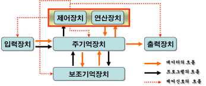

__하드웨어__: 컴퓨터를 구성하는 기계적 장치  
__소프트웨어__: 하드웨어의 동작을 지시하고 제어하는 명령어 집합

## 하드웨어

### 중앙처리장치(CPU)

인간으로 따지면 두뇌에 해당하는 부분

주기억장치에서 프로그램 명령어와 데이터를 읽어와 처리하고 명령어의 수행 순서를 제어함. 중앙처리장치는 비교와 연산을 담당하는 __산술논리연산장치(ALU)__ 와 명령어의 해석과 실행을 담당하는 __제어장치__, 속도가 빠른 데이터 기억장소인 __레지스터__ 로 구성되어있음

개인용 컴퓨터와 같은 소형 컴퓨터에서는 CPU를 마이크로프로세서라고도 부름

### 기억장치

프로그램, 데이터, 연산의 중간 결과를 저장하는 장치

주기억장치와 보조기억장치로 나누어지며, __RAM__ 과 __ROM__ 도 이곳에 해당함. 
실행중인 프로그램과 같은 프로그램에 필요한 데이터를 일시적으로 저장한다.

보조기억장치는 __하드디스크__ 등을 말하며, 주기억장치에 비해 속도는 느리지만 많은 자료를 영구적으로 보관할 수 있는 장점이 있다.

### 입출력장치

입력과 출력 장치로 나누어짐.

입력 장치는 컴퓨터 내부로 자료를 입력하는 장치 (키보드, 마우스 등) 
출력 장치는 컴퓨터에서 외부로 표현하는 장치 (프린터, 모니터, 스피커 등)

## 시스템 버스

> 하드웨어 구성 요소를 물리적으로 연결하는 선

각 구성요소가 다른 구성요소로 데이터를 보낼 수 있도록 통로가 되어줌 
용도에 따라 __데이터 버스__, __주소 버스__, __제어 버스__ 로 나누어짐

### 데이터 버스

중앙처리장치와 기타 장치 사이에서 데이터를 전달하는 통로

기억장치와 입출력장치의 명령어와 데이터를 중앙처리장치로 보내거나, 중앙처리장치의 연산 결과를 기억장치와 입출력장치로 보내는 `양방향` 버스임

### 주소 버스
데이터를 정확히 실어나르기 위해서는 기억장치 `주소`를 정해주어야 함.

주소버스는 중앙처리장치가 주기억장치나 입출력장치로 기억장치 주소를 전달하는 통로이기 때문에 `단방향` 버스임

### 제어 버스
주소 버스와 데이터 버스는 모든 장치에 공유되기 때문에 이를 제어할 수단이 필요함

제어 버스는 중앙처리장치가 기억장치나 입출력장치에 제어 신호를 전달하는 통로임

제어 신호 종류 : 기억장치 읽기 및 쓰기, 버스 요청 및 승인, 인터럽트 요청 및 승인, 클락, 리셋 등

제어 버스는 읽기 동작과 쓰기 동작을 모두 수행하기 때문에 `양방향` 버스임
